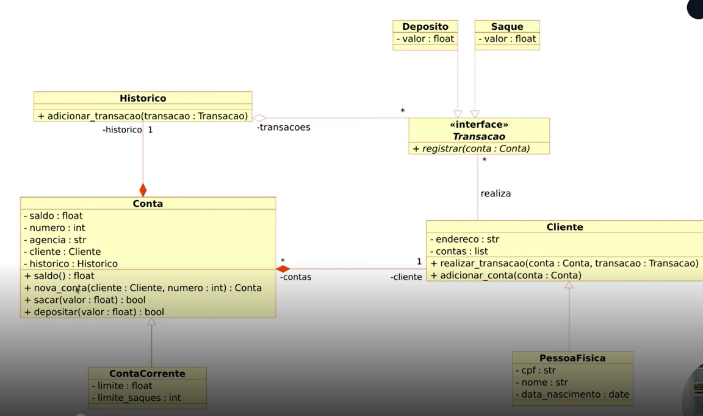

# Modelando um Sistema Bancário em POO com Python

Neste primeiro laboratório do bootcamp "Luizalabs - Back-end com Python - 2º Edição", oferecido pela DIO, a tarefa é modelar um sistema bancário conforme o diagrama UML abaixo, utilizando orientação a objetos.
O arquivo banco.py define as classes e seus métodos conforme o diagrama e o arquivo main.py, quando rodado, realiza o teste e demonstração das funcionalidades do módulo criado.

Diagrama:

